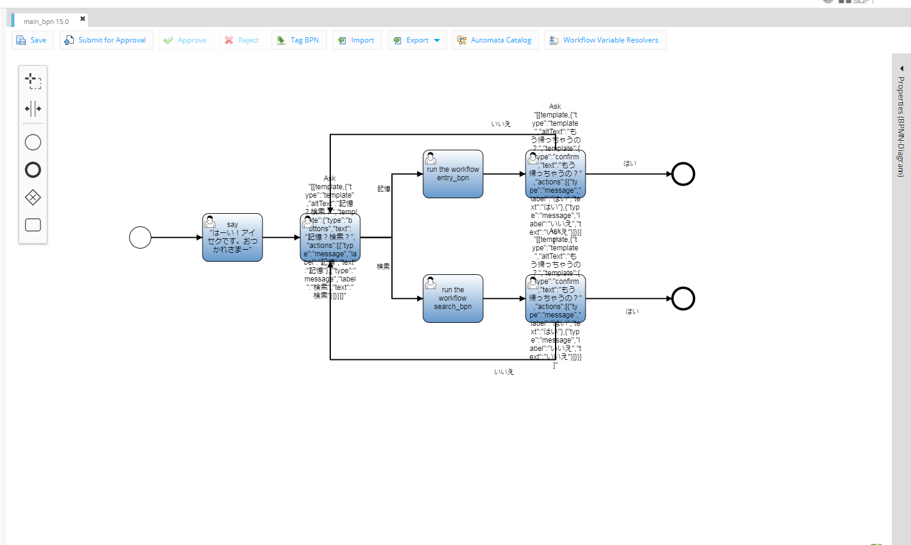

### COTOHA/AI活用コンテスト結果報告
---
### コンテスト詳細
---
- COTOHAもしくは他AI技術を利用したアイディアコンテスト
 - アイディアだけでなく、実機デモも行わないといけない
- 全82チーム593名が参加
 - Comだけでなく、グループからも多数の会社が参加
+++
<table>
  <tr>
    <th>会社名</th>
    <th>参加人数</th> 
  </tr>
  <tr>
    <th>NTTコミュニケーションズ</th>
    <th>370</th>
  </tr>
  <tr>
    <th>NTTコムエンジニアリング</th>
    <th>103</th> 
  </tr>
  <tr>
     <th>NTTコムソリューションズ</th>
     <th>50</th> 
  </tr>
  <tr>
     <th>エヌ・ティ・ティ・ビズリンク</th>
     <th>15</th> 
  </tr>
 <tr>
    <th><u>NTTPCコミュニケーションズ</u></th>
    <th><u>11</u></th> 
 </tr>
</table>
+++
<table>
 <tr>
    <th>会社名</th>
    <th>参加人数</th> 
  </tr>
 <tr>
    <th>エヌ・ティ・ティ レゾナント</th>
    <th>7</th> 
  </tr>
 <tr>
    <th>エヌ・ティ・ティ国際通信</th>
    <th>5</th> 
 </tr>
 <tr>
    <th>エヌ・ティ・ティ・コム チェオ</th>
    <th>4</th> 
  </tr>
 <tr>
    <th>NTTコム マーケティング</th>
    <th>1</th> 
 </tr>
 <tr>
    <th>その他</th>
    <th>27</th> 
 </tr>
</table>
---
- PCからは2チームが参加
 - NTTPC.make
 - <u>You?M2</u>
+++
- 構成メンバー
 - SSI
   - 内海さん
   - 森谷さん
   - 森重
  
 - 四営
   - 吉田大さん
---
### 結果
---
#### 予選落ち
+++
##### 周知の通り、NTTPC.makeの方は予選通過
##### 本日決勝戦です
---
作成したアプリケーション
+++

+++
~~~
import groovy.sql.Sql

def s_name = execution.getVariable("name")
def s_meet_day = execution.getVariable("meet_day")
def s_place = execution.getVariable("place")
def s_do = execution.getVariable("do")
def s_note = execution.getVariable("note")
def currentUser = execution.getVariable("currentUser")
def entryUserId = currentUser.firstName

def sql=Sql.newInstance("jdbc:mysql://52.198.110.117:3306/cotoha", "aifes_user",  "aifes_user",  "com.mysql.jdbc.Driver")
sql.execute("insert into aifes_demo (add_user,name,meet_day,place,do,note) values (${entryUserId},${s_name},${s_meet_day},${s_place},${s_do},${s_note})")
sql.close()
~~~
---
### 敗因と感想
---
- 完成度の低さ
  - 作成したアプリケーション
  - ビジネスモデルや運用方法
+++
- アイディアは負けてなかったと思う
  - どこにもないサービス（自分調べ）
  - 拡張性がある
---
- 熱意がすごかった
  - チームで同じユニフォーム
  - 横断幕
  
<s>正直、どちゃくそ緊張してたのであんまり覚えてない</s>
+++
- 久しぶりに新しいモノを触れたので楽しかったし、勉強になった
  - またこういう機会があれば参加する

- 強烈な緊張を味わうことができた。

- 他チームを見ることで、サービスを作るということを少しだけ学べた

- 渾身のアイディアだったため、悔しい

- <s>業務でやってるチームがあるとか知らなかった</s>
+++
- 課題
  - もっと本気になる
  - チーム開発
---
終わり
